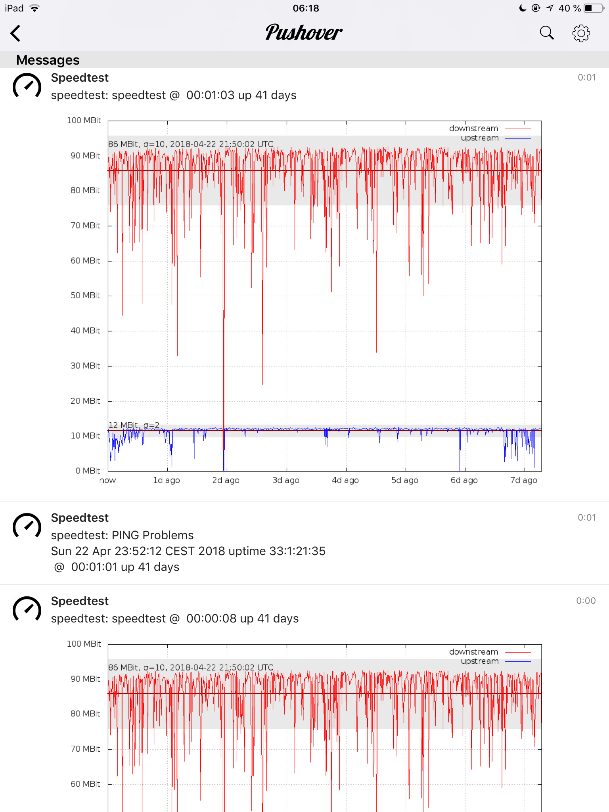
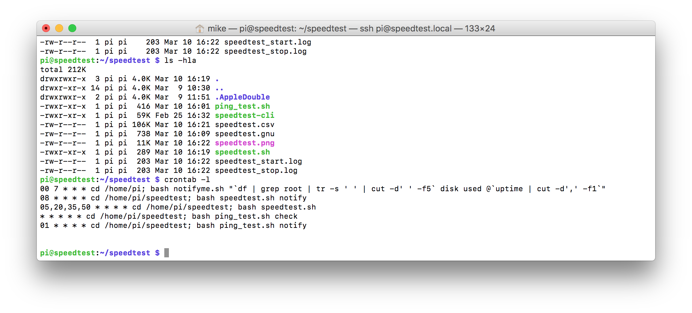

# speedtest
monitor your internet connection with a RASPBERRY PI e.g.
I provide a couple of scripts which enables you to monitor the up- and downstream speed every 15min, log the measured values and generate a graphical interpretation.

For best results use a RaspberryPI 3b or better. You will have to connect the PI over a LAN cable. <b>DO NOT USE WLAN!</b>

These prerequisities are required on the PI:

<code><b>sudo apt-get install git curl gnuplot speedtest-cli</b></code>

Next you can clone this repository by using:

<code><b>git clone https://github.com/mike5ch/speedtest.git</b></code>

For notification I use the PUSHOVER.NET service to send error notifications and graphs to my iPhone (see the template scripts for notification). My current problems with KABEL DEUTSCHLAND produced the following notifications:

 
To start the test scripts on a regular basis and send reports at appropriate times, you will have to setup crontab jobs using the test scripts.
 

The above screen shot show in total five jobs running at different times. Not all are necessary but I will explain all anyhow:

First job starts at 7:00 every day and just informs me that the PI is still running and how many space is left on the device for log files.

The second runs every hour 8 minutes past the hour and sends a graphical report.

The third is the actual speedtest. I runs every 15 minutes at 5 minutes, 20 minutes a.s.o. after the hour.

The fourth job runs every minute and tries to PING a server to detect a working internet connection.

The last job runs 1 minute past every hour and sends a report in case PING problems existed in the last hour. If not, it does nothing.
 
